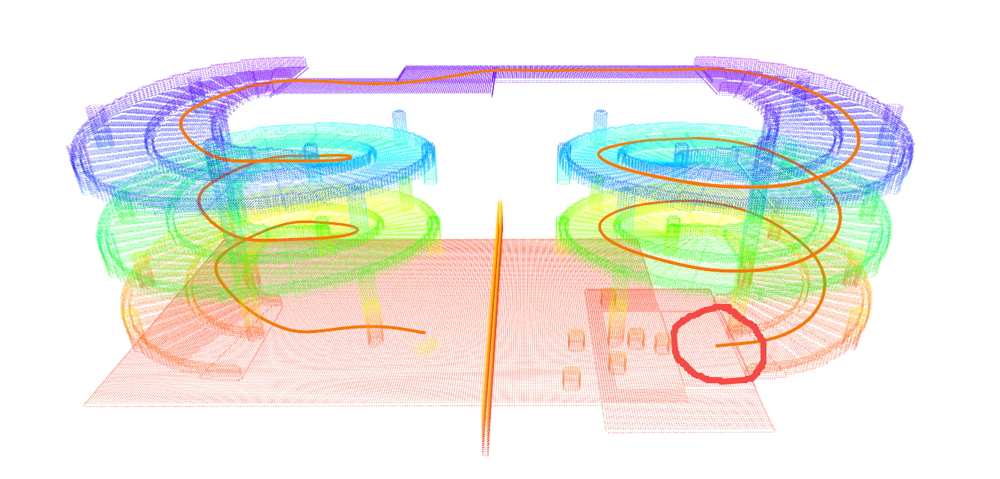
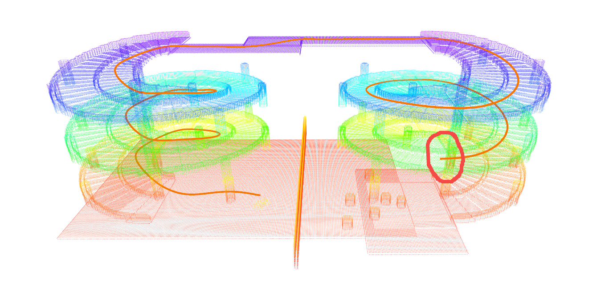
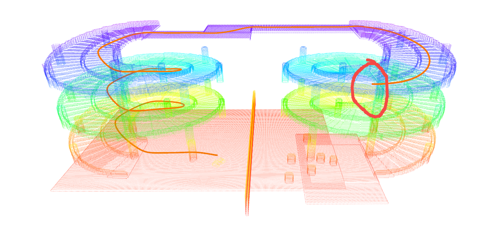

# PCT Planner

## Overview

This is an implementation of paper **Efficient Global Navigational Planning in 3-D Structures Based on Point Cloud Tomography** (accepted by TMECH).
It provides a highly efficient and extensible global navigation framework based on a tomographic understanding of the environment to navigate ground robots in multi-layer structures.

**Demonstrations**: [pct_planner](https://byangw.github.io/projects/tmech2024/)


## Citing

If you use PCT Planner, please cite the following paper:

[Efficient Global Navigational Planning in 3-D Structures Based on Point Cloud Tomography](https://ieeexplore.ieee.org/document/10531813)

```bibtex
@ARTICLE{yang2024efficient,
  author={Yang, Bowen and Cheng, Jie and Xue, Bohuan and Jiao, Jianhao and Liu, Ming},
  journal={IEEE/ASME Transactions on Mechatronics}, 
  title={Efficient Global Navigational Planning in 3-D Structures Based on Point Cloud Tomography}, 
  year={2024},
  volume={},
  number={},
  pages={1-12}
}
```

## 新增功能：支持 Z 轴高度自动选择 Slice

### 功能说明

现在 `plan()` 方法支持在起点和终点坐标中指定 Z 轴高度，系统会自动根据 tomogram 中的 `elev_g`（地面高度）和 `elev_c`（天花板高度）数据，找到该高度应该位于的有效 slice。

**使用方法：**

在 `planner/scripts/plan.py` 中，可以直接在坐标数组中指定 Z 轴高度：

```python
# 方式1：在坐标数组中直接指定 z 值
start_pos = np.array([-16.0, -6.0, 0.0], dtype=np.float32)  # [x, y, z]
end_pos = np.array([-43.0, -3.8, 8.5], dtype=np.float32)    # [x, y, z]

# 方式2：使用 2D 坐标 + 额外的 z 参数（在 planner_wrapper.py 中）
# planner.plan(start_pos, end_pos, start_z=0.0, end_z=8.5)
```

**工作原理：**

1. 系统会根据给定的 (x, y, z) 坐标，在地图中查找对应的位置
2. 遍历所有 slice，检查每个 slice 在该位置的 `elev_g` 和 `elev_c` 值
3. 如果 z 在 `[elev_g, elev_c]` 范围内，则该 slice 被视为有效
4. 如果有多个有效 slice，选择最接近 z 的 slice
5. 如果某个 slice 没有天花板限制（`elev_c = 1e6`），只要 `z >= elev_g` 就视为有效

**效果展示：**

以下三张图展示了在不同高度下自动选择 slice 的效果：


*第一层（slice 0/1）：低层路径规划*


*第二层（slice 2）：中层路径规划*


*第三层（slice 3/4）：高层路径规划*


## Prerequisites

### Environment

- Ubuntu >= 20.04
- ROS >= Noetic with ros-desktop-full installation
- CUDA >= 11.7

### Python

- Python >= 3.8
- [CuPy](https://docs.cupy.dev/en/stable/install.html) with CUDA >= 11.7
- Open3d

```bash
pip install cupy-cuda12x (对应nvidia-smi的cuda大版本)
pip install open3d
```
TP-16的本地环境是 conda env: go2w (python 3.10)
## Build & Install

Inside the package, there are two modules: the point cloud tomography module for tomogram reconstruction (in **tomography/**) and the planner module for path planning and optimization (in **planner/**).
You only need to build the planner module before use.
In **planner/**, run **build_thirdparty.sh** first and then run **build.sh**. 

全部在conda/不在conda下编译

```bash
cd planner/
./build_thirdparty.sh
./build.sh
```
error when in ./build_thirdparty.sh:
```bash
-- Could NOT find Boost (missing: Boost_INCLUDE_DIR serialization system filesystem thread program_options date_time timer chrono regex) (Required is at least version "1.65")
CMake Error at cmake/HandleBoost.cmake:33 (message):
  Missing required Boost components >= v1.65, please install/upgrade Boost or
  configure your search paths.
Call Stack (most recent call first):
  CMakeLists.txt:44 (include)
```
or
```bash
-- Found Boost: /usr/lib/x86_64-linux-gnu/cmake/Boost-1.74.0/BoostConfig.cmake (found suitable version "1.74.0", minimum required is "1.65") found components: serialization system filesystem thread program_options date_time timer chrono regex CMake Error at /usr/share/cmake-3.22/Modules/FindPackageHandleStandardArgs.cmake:230 (message): Could NOT find Eigen3 (missing: EIGEN3_INCLUDE_DIR EIGEN3_VERSION_OK) (Required is at least version "2.91.0") Call Stack (most recent call first): /usr/share/cmake-3.22/Modules/FindPackageHandleStandardArgs.cmake:594 (_FPHSA_FAILURE_MESSAGE) cmake/FindEigen3.cmake:76 (find_package_handle_standard_args) cmake/HandleEigen.cmake:14 (find_package) CMakeLists.txt:47 (include)
```
solution:
```bash
sudo apt-get update
sudo apt-get install libboost-all-dev
sudo apt-get install libeigen3-dev
```

为什么link到的是cpython-38-x86_64? delete /build and re-build sh.

## Run Examples

Three example scenarios are provided: **"Spiral"**, **"Building"**, and **"Plaza"**.
- **"Spiral"**: A spiral overpass scenario released in the [3D2M planner](https://github.com/ZJU-FAST-Lab/3D2M-planner).
- **"Building"**: A multi-layer indoor scenario with various stairs, slopes, overhangs and obstacles.
- **"Plaza"**: A complex outdoor plaza for repeated trajectory generation evaluation.

### Tomogram Construction

To plan in a scenario, first you need to construct the scene tomogram using the pcd file.
- Unzip the pcd files in **rsc/pcd/pcd_files.zip** to **rsc/pcd/**.
- For scene **"Spiral"**, you can download the pcd file from [3D2M planner spiral0.3_2.pcd](https://github.com/ZJU-FAST-Lab/3D2M-planner/tree/main/planner/src/read_pcd/PCDFiles).
- Run **roscore**, start **RViz** with the provided config (**rsc/rviz/pct_ros.rviz**). 
```bash
not: rviz rsc/rviz/pct_ros.rviz
```

- In **tomography/scripts/**, run **tomography.py** with the **--scene** argument:

下面的节点是转化PCD/同时发布信息的，可以把转化与发布分离

```bash
cd tomography/scripts/
python3 tomography.py --scene Spiral
python3 tomography.py --scene sii_l6
```
 - 报错找不到库 'libnvrtc.so.12', 先本地看看

```bash
sudo find / -name "libnvrtc.so.12"
```
 - 然后export进来
```bash
export LD_LIBRARY_PATH=/home/cjsg/miniconda3/envs/go2w/lib/python3.10/site-packages/nvidia/cuda_nvrtc/lib/:$LD_LIBRARY_PATH
```

- The generated tomogram is visualized as ROS PointCloud2 message in RViz and saved in **rsc/tomogram/**.

### Trajectory Generation 

After the tomogram is constructed, you can run the trajectory generation example.
- In **planner/scripts/**, run **plan.py** with the **--scene** argument:

```bash
export LD_LIBRARY_PATH=$LD_LIBRARY_PATH:/YOUR/DIRECTORY/TO/PCT_planner/planner/lib/3rdparty/gtsam-4.1.1/install/lib
cd planner/scripts/
python3 plan.py --scene Spiral
```

```bash
export LD_LIBRARY_PATH=$LD_LIBRARY_PATH:/home/cjsg/PCT_planner/planner/lib/3rdparty/gtsam-4.1.1/install/lib
cd planner/scripts/
python3 plan.py --scene Building
```

```bash
export LD_LIBRARY_PATH=$LD_LIBRARY_PATH:/home/cjsg/PCT_planner/planner/lib/3rdparty/gtsam-4.1.1/install/lib
cd planner/scripts/
python3 plan.py --scene sii_l6
```

- The generated trajectory is visualized as ROS Path message in RViz.

## License

The source code is released under [GPLv2](http://www.gnu.org/licenses/) license.

For commercial use, please contact Bowen Yang [byangar@connect.ust.hk](mailto:byangar@connect.ust.hk).